# Objective: 

Develop a comprehensive project plan for a data science analysis project using R. This task requires you to plan every phase of a project including goal setting, timeline, roles, and resource allocation, ensuring a clear project roadmap.

---

# Key Steps:

## 1.Define the Project Objective: 
Start by clearly outlining what you intend to achieve from the project. Identify the problem you want to solve or the question you want to answer using data science techniques in R.

## 2.Research Background: 
Provide context and rationale for selecting the project topic. Include an overview of relevant literature or previous studies.

## 3.Plan the Project Phases: 
Break down the project lifecycle into phases such as data collection (if applicable), data cleaning, analysis, model development, and reporting. Include estimated timelines for each phase.

## 4.Assign Roles and Responsibilities: 
Even if you are working alone, define the roles you will assume (analyst, programmer, project manager) and outline tasks accordingly.

## 5.Risk Management: 
Identify potential risks and propose mitigation strategies.

---

# Dataset used:
I am using the Facebook Dataset given by a prof. named Mr. Tushar Mahore

# About the dataset:
The original dataset is provided in a .csv format. But this dataset was totally in comma seperated format as shown in the figure.

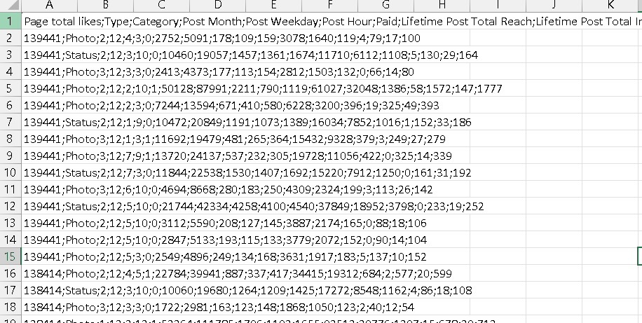

So lets first convert it into a proper excel format. For this I'm using Excel for proper data formatting.

---

# Steps for formatting

## Step 1:
For this I go to "data" tab and then to "Text to Columns" and then select the Delimited option.
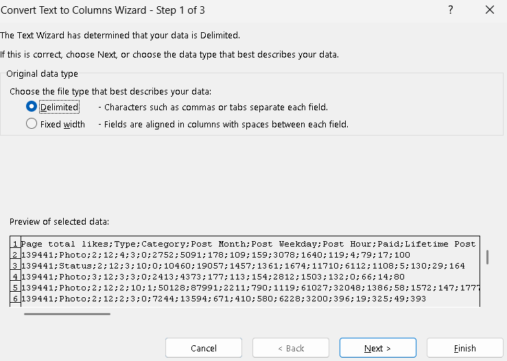

## Step 2:
Then select the "Semicolon" option.
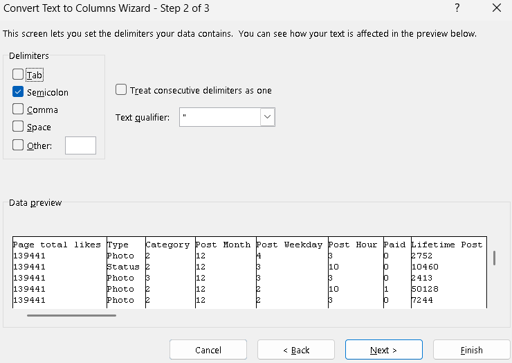

## Step 3:
Selet the general option and then click finish.
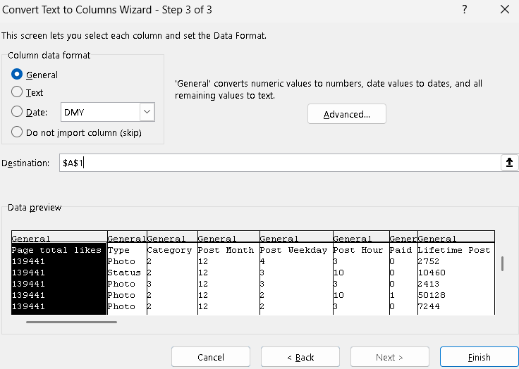

---

# Code snippets

## Import Dataset

Since the dataset is in .xlsx format we need to import/install the readxl module for it.

## Calculation to make

    - Maximum number of likes.
        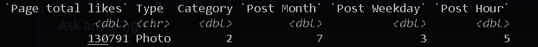
    - Average number of shares per post.
        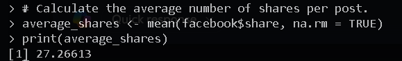
    - Creating a new column named Engagement.
        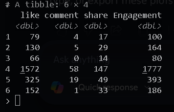
    - Grouping post by types and computing average like.
        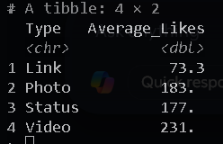

## Exploratory Data Analysis (EDA)

	- Create a scatter plot of Likes vs Comments.
        
	- Create a histogram of Shares.
        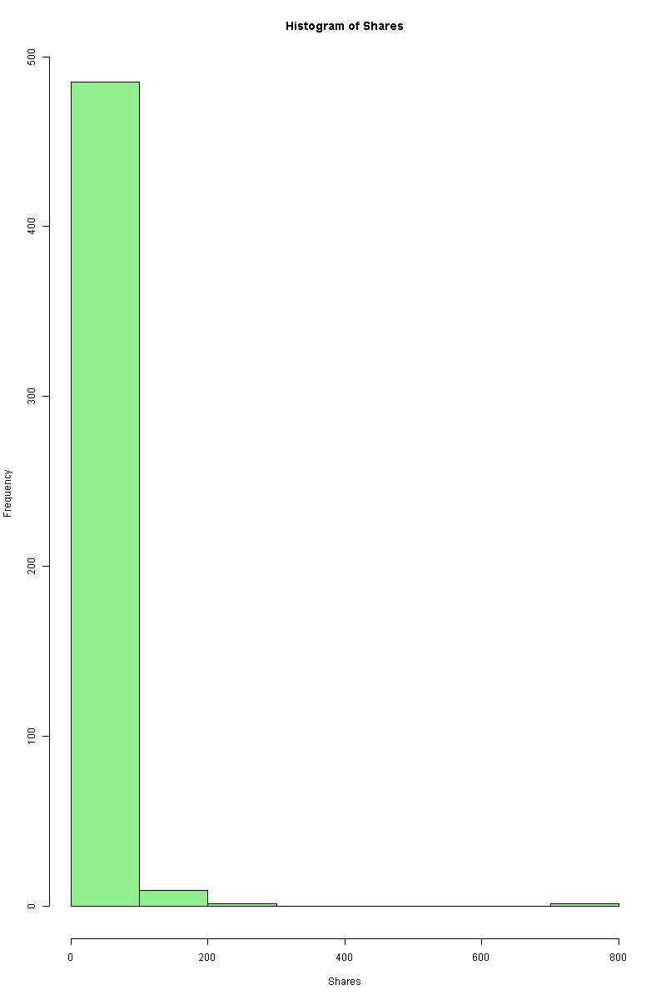
    - Create a boxplot of Likes
        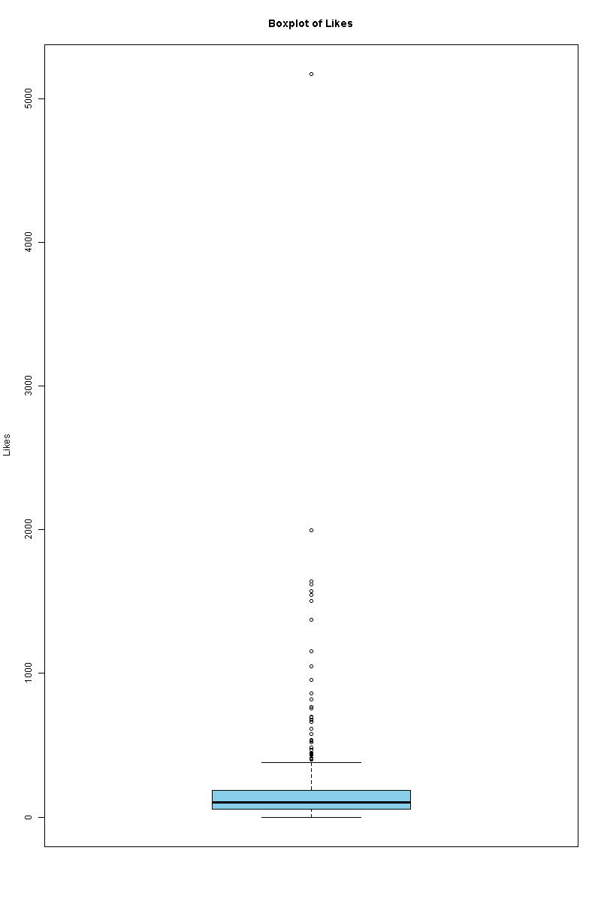
    - Identify outliers
        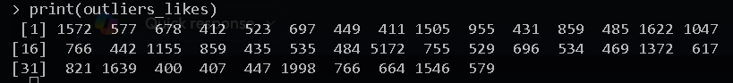
    - Create a Combined boxplot
        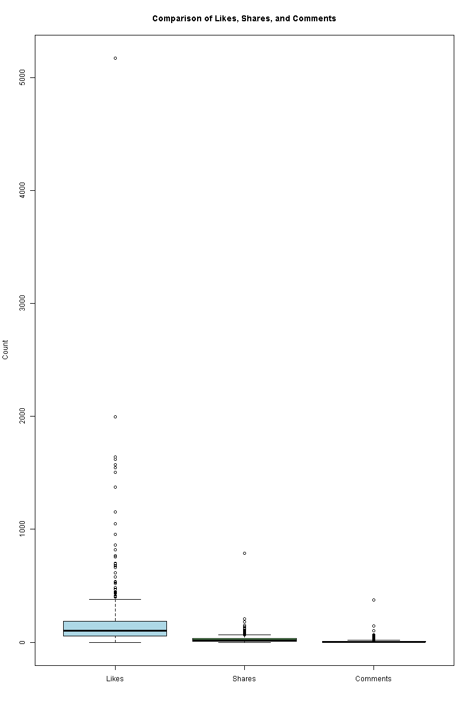

## IQR (Inter Quartile Range)
    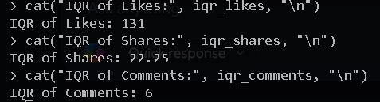
